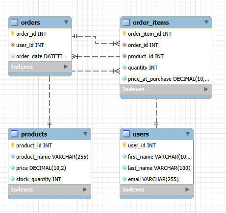

# Mini Commerce Platform Project Outline

## PART 1 - SQL DATABASE DESIGN

* 3NF satisfied: Each table stores information about one subject, repeated data is minimized, and all non-key columns depend only on the primary key of their own table.

### Two most useful indexes: 

#### 1 - Orders by User: It quickly finds all orders that belong to a specific user. 

* Benefitting Queries:

```
SELECT *
FROM Orders
WHERE user_id = 1;
```

```
SELECT 
    Users.first_name,
    Users.last_name,
    Orders.order_id,
    Orders.order_date
FROM Users
JOIN Orders
    ON Users.user_id = Orders.user_id
WHERE Users.user_id = 1;
```

* Trade-off: This improves read performance, but slightly slows down inserts and updates because MySQL must also update the index whenever a new order is added or changed. 

#### 2 - Order Items by Order: It quickly finds all products inside a specific order.

* Benefitting Queries:

```
SELECT 
    Products.product_name,
    Order_Items.quantity,
    Order_Items.price_at_purchase
FROM Order_Items
JOIN Products
    ON Order_Items.product_id = Products.product_id
WHERE Order_Items.order_id = 1;
```

```
SELECT 
    Orders.order_id,
    SUM(Order_Items.quantity * Order_Items.price_at_purchase) AS total_order_value
FROM Orders
JOIN Order_Items
    ON Orders.order_id = Order_Items.order_id
WHERE Orders.order_id = 1
GROUP BY Orders.order_id;
```

* Trade-off: This improves lookup speed for reading order details, but adds extra storage and slightly slows down inserting new order items.

## PART 2 - NOSQL DATABASE DESIGN

* NoSQL is appropriate for a product catalog because products can have different attributes.

* Embedded Fields: categories, pricing, attributes. They are embedded because they are closely related to the product and are usually loaded whenever the product is viewed.

* Referenced Fields: brand_id, supplier_id, category_id, review_ids

### CRUD Operations:

#### INSERT

```
{
  "product_id": 6,
  "product_name": "Webcam",
  "categories": ["Electronics", "Accessories"],
  "pricing": {
    "current_price": 59.99,
    "currency": "USD"
  },
  "stock_quantity": 25,
  "attributes": {
    "brand": "StreamView",
    "resolution": "1080p"
  }
}
```

#### FIND

```
[
  {
    "product_name": "Wireless Mouse"
  },
  {
    "product_name": "Keyboard"
  },
  {
    "product_name": "USB-C Cable"
  }
]
```

#### UPDATE
(change price of product 2 from 24.99 to 19.99)

```
{
  "product_id": 2,
  "product_name": "Wireless Mouse",
  "pricing": {
    "current_price": 19.99,
    "currency": "USD"
  }
}
```

#### DELETE
(remove product 6)

#### PAGINATION
(assume catalog contains 5 products)

```
PAGE 1
[
  {
    "product_name": "Laptop"
  },
  {
    "product_name": "Wireless Mouse"
  }
]
PAGE 2
[
  {
    "product_name": "Keyboard"
  },
  {
    "product_name": "Monitor"
  }
]
PAGE 3
[
  {
    "product_name": "USB-C Cable"
  }
]
```

### Aggregate Pipeline

The aggregation pipeline processes product catalog documents in multiple stages. First, the category array is unwound so products with multiple categories can be grouped correctly. Next, products are grouped by category, and the average product price is calculated for each category using the current product price. The project stage formats the output so only the category name and average price are shown. Finally, the results are sorted by average price to make the report easier to analyze.

## PART 3 - ARCHITECTURE & TRADE-OFFS

### SQL VS NoSQL Justification

* Order data is stored in SQL, because it is highly relational and requires strong consistency. SQL is useful for calculating totals, tracking purchases, and making sure records remain accurate.

* Product catalog data is stored in NoSQL, because products often have flexible and varied attributes. This makes NoSQL useful for fast product lookups, changing details, and supporting different product types withough redesigning a table every time new attributes are added.

### Transactions & Consistency

* ACID Properties are best suited to SQL data structures because ACID is a set of rules that helps ensure database transactions are processed reliably and accurately. ACID = Atomicity, Consistency, Isolation, Durability

* Eventual Consistency is a different approach best suited to NoSQL systems, because instead of guaranteeing that every copy of the data is updated immediately, the system allows updates to propagate over time. The system becomes consistent eventually rather than instantly.

* ACID is best when accuracy is more important than speed (Users and Orders). Eventual consistency is best when speed, scalability, and availability are more important than immediate accuracy (Products).

### Polyglot Persistence

* Polyglot Persistence is the practice of using multiple database technologies within a single application architecture. In the Mini Commerce Platform, SQL is used to store users, orders, and order items because these entities require strong relationships, transactional integrity, and ACID guarantees. NoSQL is used for the product catalog because products have flexible attributes and benefit from a document-based structure. By combining SQL and NoSQL databases, the application can take advantage of the strengths of both technologies, improving flexibility, scalability, and overall performance.

## PART 4 - APPLICATION INTEGRATION

### ORM (Object Relational Mapping)
* Uses objects instead of manual SQL query writing. 

* Without ORM:

```
	SELECT *
	FROM Users
	WHERE user_id = 1;
```
* With ORM:

```
	User.findById(1);
```

* This leads to easier development, object-oriented design, database abstraction, and smoother relationship handling.

#### Common ORM Examples

* Hibernate (Java)
* Entity Framework (.NET)
* Sequelize (Node.js)
* Prisma (Node.js / TypeScript)

### ODM (Object Document Mapping) 
* Acts as a translator between application code and document-based databases.

* Without ODM:

```
	{
 	 "product_id": 1,
 	 "product_name": "Laptop",
 	 "pricing": {
 	   "current_price": 899.99
 	 }
	}
```  

* With ODM:

``` 
	const product = Product.findById(1);
	console.log(product.product_name);
``` 

* This works directly with document-style data structures, flexible schemas, gives easier handling of nested data, and helps developers spend less time manually converting JSON documents into application objects.

#### Common ODM Examples

* Mongoose
* MongoEngine
* Morphia

### EER Diagram (SQL) and Document Model Diagram (NoSQL)

#### EER Diagram


#### Document Model Diagram

```
products.json
│
└── products [array]
    │
    └── product document
        ├── product_id
        ├── product_name
        ├── description
        ├── categories [embedded array]
        │   ├── "Electronics"
        │   ├── "Accessories"
        │   └── "Computers"
        │
        ├── pricing [embedded object]
        │   ├── current_price
        │   ├── currency
        │   └── discount_price
        │
        ├── stock_quantity
        │
        └── attributes [embedded object]
            ├── brand
            ├── screen_size
            ├── storage
            ├── ram
            ├── connection_type
            ├── resolution
            ├── length
            └── connector_type
```

## Concepts Learned

### Four major areas of modern data engineering and software development:

1. Relational Database Design (SQL)
    * Tables, relationships, normalization, querying.
2. Document Database Design (NoSQL)
    * JSON modeling, flexible schemas, aggregation.
3. Database Architecture
    * SQL vs NoSQL, ACID vs Eventual Consistency, Polyglot Persistence.
4. Application Integration
    * ORM, ODM, and how software applications communicate with databases.

## 👤 Author

Amanda McIntire

## 📄 License

This project was created as part of a software engineering bootcamp and is intended for educational and portfolio purposes.